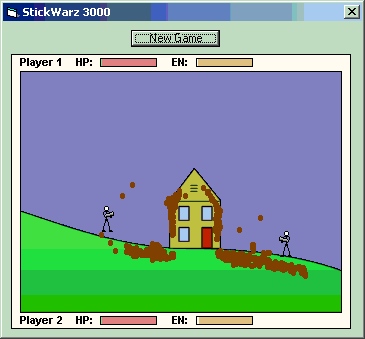



## Stick Warz 3000 alpha release \(yes\! its back\)

### Description

Hey everyone, havent done anything in vb lately, so i have decided to make a new stickwarz game. This one will be better, obviously. The game is not quite done yet, it still needs alot of work, the players dont even die yet, but thats why its only an alpha release. So far all you can do it jump around, kick, punch, and... you guessed it! fling poo. Dont be scared though, the game will have alot more characters to play around with in the future, and the "classic" character is unlocked in the game but it has no special weapon yet, cannot think of one. You cannot select levels yet either. Well, anyways, enjoy the game and please comment, i need ideas. and yes... for all those wondering... that is a house... covered in poo
 
### More Info
 

             |
---                |---
**Submitted On**   |2004-03-11 18:57:18
**By**             |[poop\_4\_brains](https://github.com/Planet-Source-Code/PSCIndex/blob/master/ByAuthor/poop-4-brains.md)
**Level**          |Intermediate
**User Rating**    |5.0 (10 globes from 2 users)
**Compatibility**  |VB 6\.0
**Category**       |[Games](https://github.com/Planet-Source-Code/PSCIndex/blob/master/ByCategory/games__1-38.md)
**World**          |[Visual Basic](https://github.com/Planet-Source-Code/PSCIndex/blob/master/ByWorld/visual-basic.md)
**Archive File**   |[Stick\_Warz1719133112004\.zip](https://github.com/Planet-Source-Code/poop-4-brains-stick-warz-3000-alpha-release-yes-its-back__1-52317/archive/master.zip)

